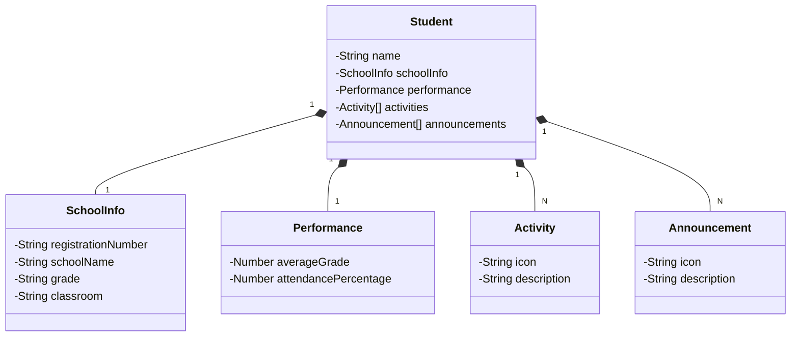

# API de Gerenciamento de Estudantes 🎓

Projeto desenvolvido durante um curso da **DIO (Digital Innovation One)**, com o objetivo de aprender **Java** e as tecnologias para o desenvolvimento de sistemas back-end utilizando **Spring Boot**, **PostgreSQL** e outras ferramentas associadas.

## Sobre o Projeto 📚  
A **API de Gerenciamento de Estudantes** permite realizar o cadastro, consulta, atualização e exclusão de informações dos estudantes, como dados acadêmicos e de matrícula. O sistema utiliza **Spring Boot** para o desenvolvimento da lógica do back-end e **PostgreSQL** para persistir as informações.

## Funcionalidades 🔧  
- **Cadastro de Estudantes**: Permite adicionar novos estudantes à base de dados com informações de matrícula, escola e desempenho.  
- **Edição de Dados**: Atualiza as informações dos estudantes, como o desempenho acadêmico e dados de matrícula.  
- **Exclusão de Estudantes**: Remove os registros dos estudantes do banco de dados.  
- **Listagem de Estudantes**: Retorna todos os estudantes cadastrados no sistema.  

## Tecnologias Utilizadas 🚀  
- **Spring Boot**: Framework para o desenvolvimento do back-end e criação da API RESTful.  
- **PostgreSQL**: Banco de dados relacional utilizado para persistir as informações dos estudantes.  
- **JPA (Hibernate)**: Utilizado para mapear os dados entre o modelo de objetos Java e o banco de dados.  
- **Spring Data JPA**: Repositório que facilita o acesso aos dados, com consultas otimizadas ao banco de dados.

Este projeto foi desenvolvido para aprimorar o conhecimento em desenvolvimento de **APIs** com **Java** e **Spring Boot**, além de trabalhar com **PostgreSQL** para persistir dados de forma eficiente.

