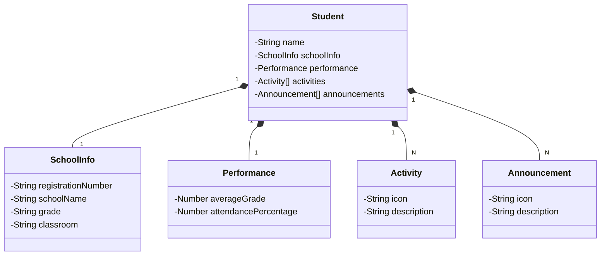

# Sistema de Gerenciamento de Estudantes 🎓

Projeto desenvolvido durante um curso da **DIO (Digital Innovation One)**, com o objetivo de aprender **Java** e as tecnologias para o desenvolvimento de sistemas back-end utilizando **Spring Boot**, **PostgreSQL** e outras ferramentas modernas.

## Sobre o Projeto 📚  
O Sistema de Gerenciamento de Estudantes foi criado para permitir o cadastro, consulta, atualização e exclusão de informações de estudantes, com foco no gerenciamento de dados acadêmicos e pessoais. A aplicação oferece uma interface simples para gerenciar os registros dos estudantes, incluindo informações como matrícula, desempenho e atividades.

## Funcionalidades 🔧  
- **Cadastro de Estudantes**: Permite adicionar novos estudantes ao sistema com dados de matrícula e informações acadêmicas.  
- **Edição de Dados**: Atualiza informações dos estudantes, como desempenho e dados pessoais.  
- **Exclusão de Estudantes**: Permite remover registros de estudantes do sistema.  
- **Listagem de Estudantes**: Exibe todos os estudantes cadastrados para facilitar a consulta de suas informações.  

## Tecnologias Utilizadas 🚀  
- **Spring Boot**: Framework Java utilizado para o desenvolvimento do back-end e criação da API RESTful.  
- **PostgreSQL**: Banco de dados relacional para persistir as informações dos estudantes.  
- **JPA (Hibernate)**: Mapeamento objeto-relacional para integrar a aplicação com o banco de dados.  
- **Spring Data**: Repositório para acessar os dados de forma eficiente e simplificada.

Este projeto foi desenvolvido para aprimorar o conhecimento em desenvolvimento back-end com **Java** e **Spring Boot**, além de garantir um entendimento prático do uso de bancos de dados relacionais como **PostgreSQL**.

